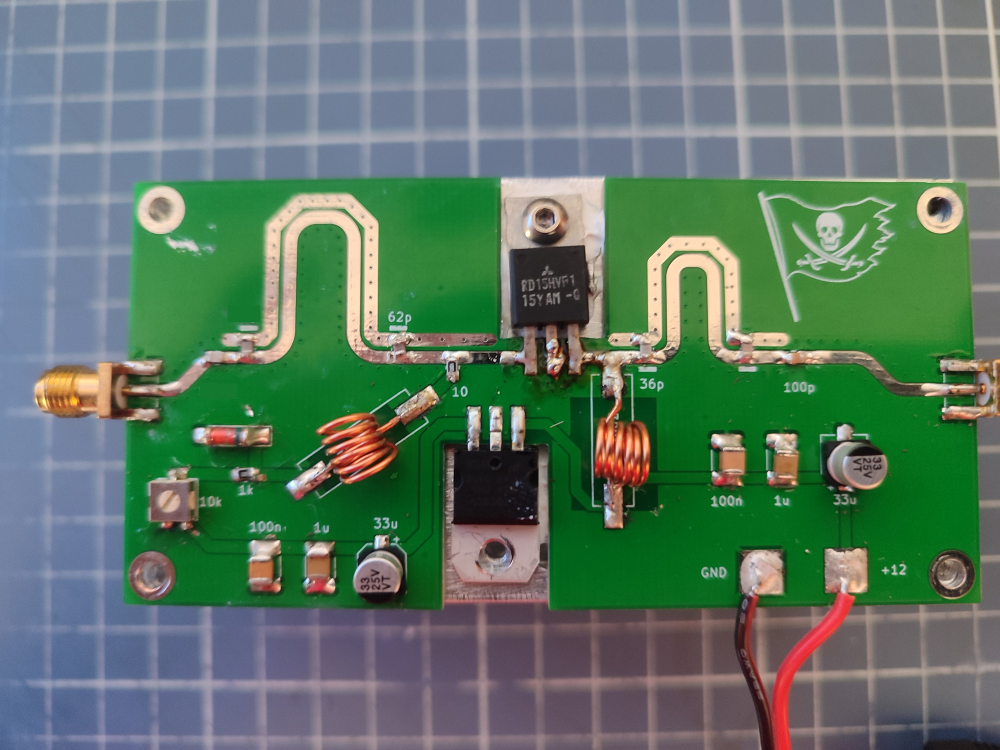

# RD15HVF1 Amplifier for 280-320 mhz

This repo consists of a board that uses the RD15HVF1 amplifier at satcom frequency range (280-320Mhz).  

#### Please make sure to visit the [satcom radio website](https://satcomradio.github.io/) for more information


------

## Important notes:

- Do not put more than 6W of input RF power. The max power output of this PA is around 20W. Check the datasheet.
- You will need a tx/rx swith if you want to recieve when using this amplifier and also a lowpass filter to avoid it's harmonics!
- The recomended vias voltage is 2.7v. **Before soldering the amplifier adjust the potentiometer!**


- There are **a lot** of fake RD15HVF1 chips on aliexpress!  
- It's better to buy a used RD15HVF1 with the legs cut (as in [here](https://aliexpress.com/item/1005008441262750.html) than take the risk of buying a "new" one that is fake.

## Features:

- With 4W at 300mhz it gives an output of around 23W at 13.8v
- The input SWR is well tunned


## Aditional information:

- Be sure to use a proper heatsink. Ideally it should be 100x50mm. [This](https://aliexpress.com/item/1005004879389236.html) is the one I've got


- Apply thermal paste between the `RD15HVF1` amplifier and the heatsink
- The wound coils act as RF chokes. They should have between 150-300nH so wound a 0.7mm enameled wire around a 5mm drill bit for 6 turns
- The zener diode acts as a voltage limiter. Buy one with a breakdown voltage of around 4v so even if the potentiometer is open it will not push to the bias the 9v of the voltage regulator
- If the amplifier is not properly bolted to the heatsink or the coils are not correct, the output power will oscilate.
- If you buy one of those cheap black amplifiers of 4W for HF,VHF on aliexpress and connect a hackrf to it before connecting it to this amplifier, you'll get an output power of around 16W.
------

## Ordering the PCB:

Download the [GERBER-Amplifier](./GERBER-Amplifier.zip) file from this repo and order it a jlcpcb with the default options.  
The only option I've changed is to remove the manufacture code mark


------

## Prototype image:



------

## Output power:

### 2W input

| Freq in Mhz | Output power (W) |
|-------------|------------------|
| 270 | 14.3 |
| 280 | 16.5 |
| 290 | 15.5 |
| 300 | 14.5 |
| 310 | 14.1 |
| 320 | 13.3 |

At 4W input power the output is >20W

------

## BOM:

```
- PCB that you can order ar jlcpcb or somewhere else.
- RD15HVF1 (https://aliexpress.com/item/1005008441262750.html)
- 0805 560p Capacitor
- 0805 27p Capacitor
- 0805 62p Capacitor
- 0805 36p Capacitor
- 0805 8p Capacitor
- 0805 100p Capacitor
- 2x 1812 100n Capacitor
- 2x 1812 1u Capacitor
- 0805 10 ohm resistor
- 0805 1k ohm resistor
- L7809  9v voltage regulator
- 33uF SMD electrolitic cap 25v 5X5.4mm (https://aliexpress.com/item/1005005427427871.html)
- 3314G 10k potentiometer (https://aliexpress.com/item/1005003118598266.html)
- 100x50x50mm heatsink (https://aliexpress.com/item/1005004879389236.html)
- 0.7mm enameled wire for making air wound coils
- 2x SMA connectors
- (Optional) LL41 SMD 3v9 or 4v7 Zener Diode (Voltage limiter)
```
